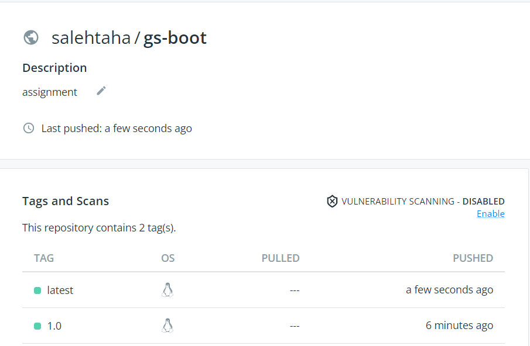

# gs-spring-boot

we used the https://github.com/spring-guides/gs-spring-boot.git reository to dockerize a spring boot application with multi-stage build. 


## Run Locally

Clone the project

```bash
  git clone https://github.com/mohamadassi173/gs-docker
```

Go to the project directory

```bash
  cd gs-docker
```

Build

```bash
  docker build -t gs-boot .
```

Run

```bash
  docker run -d -p 8080:8080 gs-boot
```


## DockerHub

Run the image from DockerHub

```bash
  docker pull salehtaha/gs-boot:latest
  docker run -d -p 8080:8080 salehtaha/gs-boot:latest
```



